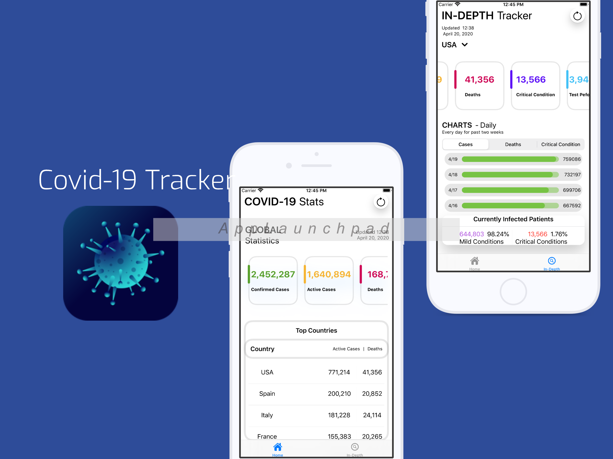

# COVID-19-Tracker



<a href="https://domenighi.com">
      
    </a>
    <a href="LICENSE.md">
      
    </a>

## Features
- Allow to select  from a list of different  countries
- Sorts data on the main view from highest cases to lowest cases in the most affected countries 
- Uses the NovelCovid API which gets its information from John Hopkins University and Worldmeters (https://corona.lmao.ninja/)


## Requirements
In order to compile COVID-19 Tracker you will need to meet the following requirements:
```
- A Mac running Catalina (macOS 10.15+)
- Xcode 11.0 or later
```
